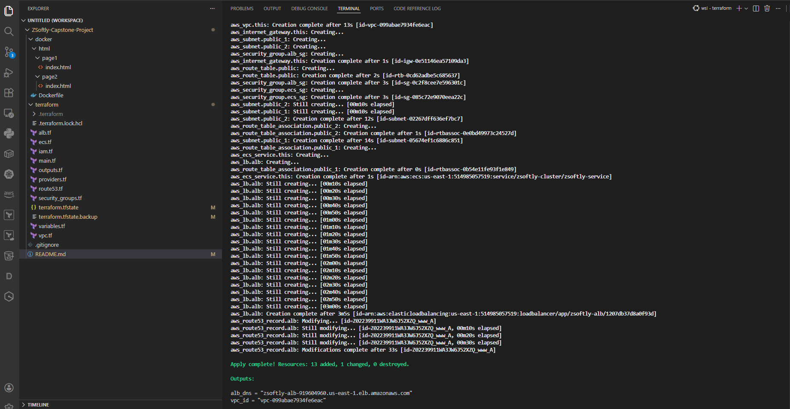
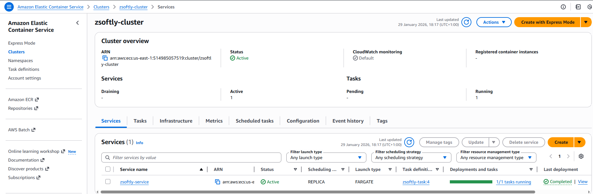
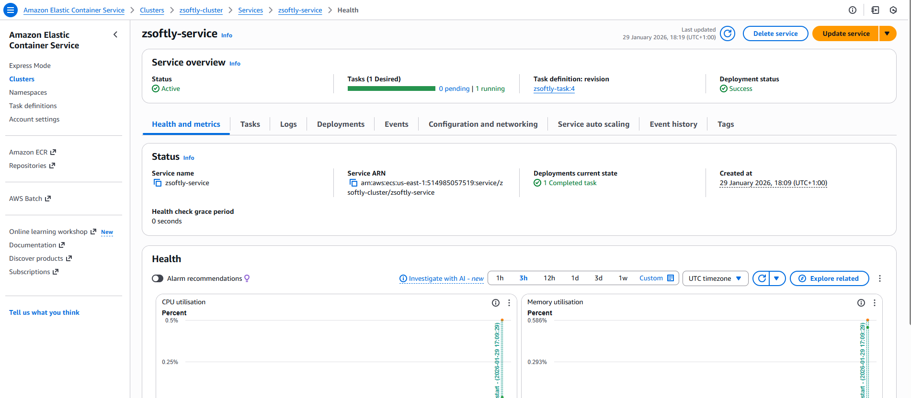
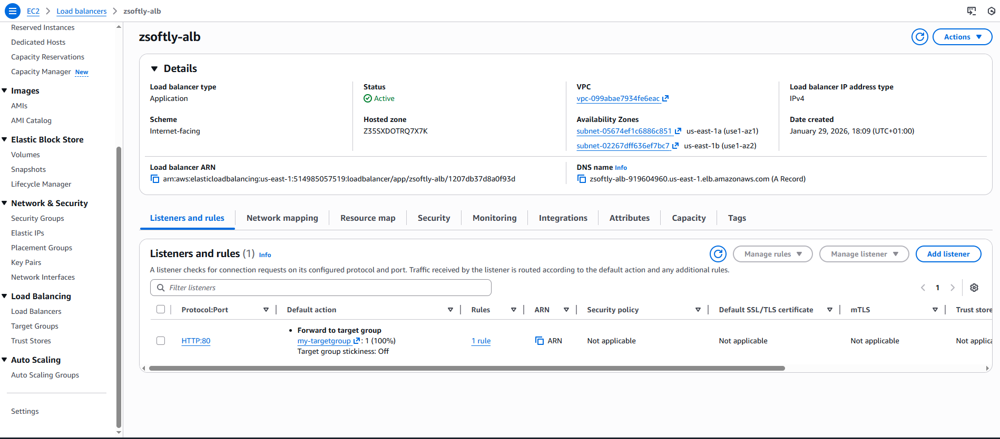

# ZSoftly Capstone Project

This project deploys a stateless containerized web application on AWS ECS Fargate using Terraform.

## Architecture

Terraform-based AWS infrastructure deploying:
- VPC with public subnets
- ECS Fargate
- Application Load Balancer
- Route 53
- ECR
- Terraform (raw resources)
- Dockerized web app

## Deployment

1. Build and push Docker image to ECR
2. Run terraform init/plan/apply

## Validation

The application is accessible via:
- /page1
- /page2

## Screenshots

### Terraform Apply

### ECS Cluster

### ECS Service Running

### Application Load Balancer

### Application Pages

